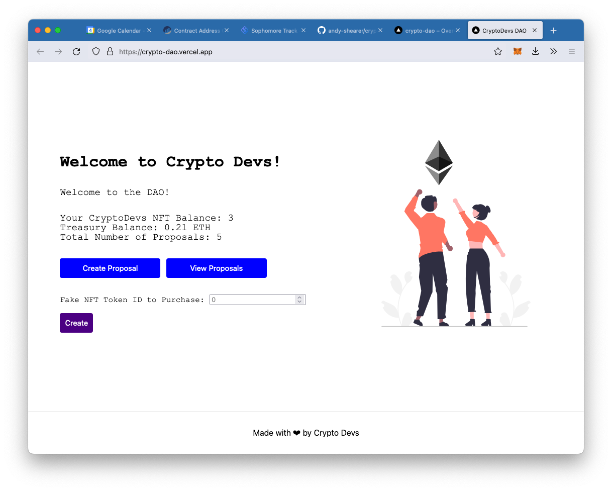

# Decentralised Autonomous Organisation (DAO)
Project following [LearnWeb3DAO Sophmore track](https://www.learnweb3.io/tracks/sophomore) to create the smart
contract and build a front-end for a DAO. This project builds upon the functionality
from [andy-shearer/nft-collection](https://github.com/andy-shearer/nft-collection) and allows owners of the CryptoDevs
NFT to create, vote, and execute proposals to buy NFTs from a mock marketplace. Owners can vote depending on the amount
of NFTs that they own, and cannot double-vote on a proposal.

Built using hardhat and next.js - see both README files in the relevant subdirectories 
([hardhat](./hardhat/README.md) / [next.js](./my-app/README.md))

Deployed to: https://crypto-dao.vercel.app/ check it out on the Rinkeby testnet!

